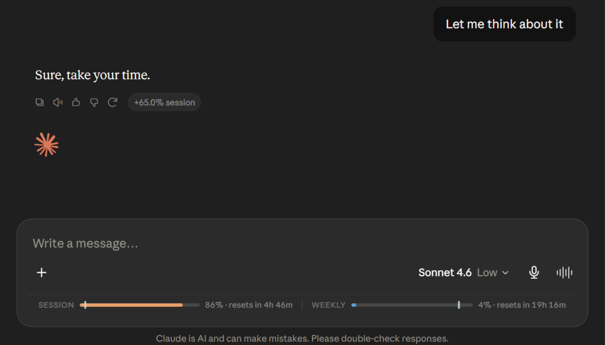
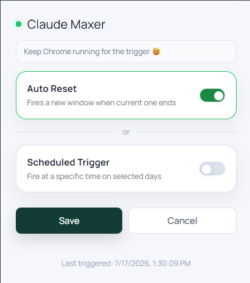

# Claude Maxer

A Chrome extension for [claude.ai](https://claude.ai) that shows your live usage limits right in the page, adds a toolbar badge, tracks per-message cost, and can automatically open a fresh session when your usage window resets.

## Features

- **Live usage bar** injected into the Claude.ai UI, showing both the 5-hour session window and the 7-day weekly window.
- **Toolbar badge** showsn live session usage %, so you can check usage without even opening a tab.
- **Per-message cost** tag appears at the end of the response showing how much session that specific message used (at least 2 messages in the chat needed).
- **Real-time updates** from Claude's own SSE stream.
- **Auto-reset mode** waits for your current session window to end, then opens a fresh incognito Claude tab automatically.
- **Scheduled trigger** fires at a specific time on chosen days instead of waiting for a natural reset.
- **Notifications** for successful triggers and failures.

## Installation

1. **Download ZIP**, then extract it somewhere
2. Open Chrome and go to `chrome://extensions`.
3. Turn on **Developer mode** using the toggle in the top-right corner.
4. Click **Load unpacked**.
5. Select the folder you extracted.
6. Pin the extension to your toolbar so you can see the usage badge.
7. Open [claude.ai](https://claude.ai). The usage bar should appear automatically.

To update later, ee-download the ZIP and click the reload icon on the extension's card in `chrome://extensions`. After updating, also refresh any open claude.ai tabs.

## Permissions

| Permission | Why it's needed |
|---|---|
| `cookies` | Reads the `lastActiveOrg` cookie on claude.ai to know which organization's usage endpoint to query. |
| `storage` | Saves your settings (auto-reset toggle, schedule, last usage snapshot) locally/synced across your signed-in Chrome. |
| `alarms` | Powers the auto-reset and scheduled-trigger timers. |
| `notifications` | Shows a system notification when a trigger succeeds or fails. |
| `tabs` | Opens/closes the Claude tab used by auto-reset and the scheduled trigger. |
| Host access to `https://claude.ai/*` | The extension only ever runs on claude.ai. |

No data leaves your browser. Nothing is sent to any server other than claude.ai itself (which your browser was already talking to).

<!-- ## Credits

Inspired by [Claude Counter](https://github.com/she-llac/claude-counter) by she-llac -->